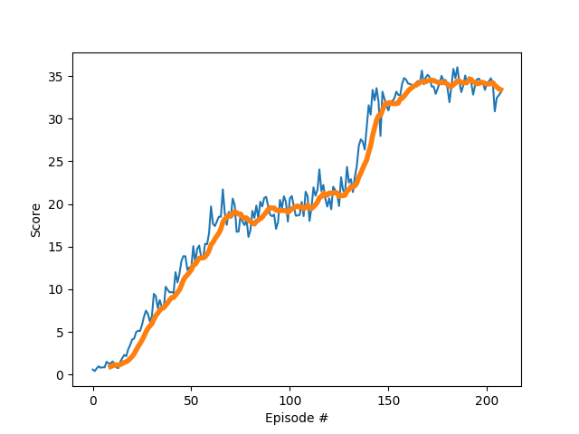

# Report
This report shortly summarizes the details of the deep reinforcement learning algorithm that was applied
to train multiple agents on Unity's **Reacher** environment. 

  

In this environment, multiple double-jointed arms can move to target locations. A reward of +0.1 is provided for each step that the agent's hand is in the goal location. Thus, the goal of the agent is to maintain its position at the target location for as many time steps as possible.

The observation space consists of 33 variables corresponding to position, rotation, velocity, and angular velocities of the arm. Each action is a vector with four numbers, corresponding to torque applicable to two joints. Every entry in the action vector should be a number between -1 and 1.

## Learning Algorithm

The agent is trained using a reinforcement learning technique called **Deep Deterministic Policy Gradients (DDPG)** to learn from the environment. The method has been shown to be well suited for solving challenging problems with continuous action spaces. For more information see [Continuous Control With Deep Reinforcement Learning](https://arxiv.org/pdf/1509.02971.pdf).

Pseudo code for the algorithm is shown in the following Figure.

  

### Network Architecture

The **Actor** maps a state of the environment to action values via 3 fully connected **Linear** layers with **ReLU** activation. The final output layer yields 4 values with **tanh** activation. 

The **Critic** measures the quality of the actions via 3 fully connected **Linear** layers with **ReLU** activation. The single output of the last layer returns the estimated value of the current action.


### Hyperparameters
```
BATCH_SIZE = 128        # minibatch size
BUFFER_SIZE = 100000    # replay buffer size
GAMMA = 0.99            # discount factor
LR_ACTOR = 1e-4         # learning rate of the actor 
LR_CRITIC = 1e-3        # learning rate of the critic
TAU = 1e-3              # for soft update of target parameters
WEIGHT_DECAY = 0        # L2 weight decay
```

## Achieved Rewards
The agent was trained until an average reward of +30 was achieved.  
  
The plot shows the average rewards and its rolling mean. The agent is clearly able to learn how to handle the environment successfully. The environment is solved in 241 episodes.

## Ideas for Future Work
No real effort was spent on optimizing the various hyperparameters. A grid-search can be used to investigate their influence on the solution. It might be interesting to compare these results to other advanced algorithms that use multiple (non-interacting, parallel) copies of the same agent to distribute the task of gathering experience like:
- [A3C](https://arxiv.org/pdf/1602.01783.pdf)
- [D4PG](https://openreview.net/pdf?id=SyZipzbCb)
